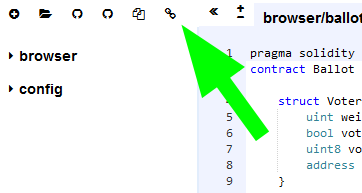

# CryptoPrincipal

CryptoPrincipal is a game centered around breedable, collectible, and oh-so-adorable creatures we call CryptoPrincipal! Each cat is one-of-a-kind and 100% owned by you; it cannot be replicated, taken away, or destroyed.

## Development Workflow

We recommend using Remix IDE with remixd. Remix is a browser based IDE for Solidity, and remixd is a utility program for sharing folder with Remix. Follow the steps below to setup the environment:

1. Download and install [npm](https://nodejs.org/en/download/).
2. If you are using Windows, execute this commands before proceeding to step 3:

   > npm install --global --production windows-build-tools

3. Run:

   > npm install -g remixd

4. Use the following call to share a folder with Remix:

   > remixd -s \<shared folder\>

5. Open [Remix IDE](http://remix.ethereum.org/) (consider using non-https URL or the connection might be blocked).

6. Click on this button and you will see the shared folder show up as "localhost":
   

## Team

(no particular order)

* 張育維 (Front End, Website)
* 曾煒傑 (Front End, Website)
* 蔡尚軒 (Smart Contract)
* 張子捷 (Smart Contract)